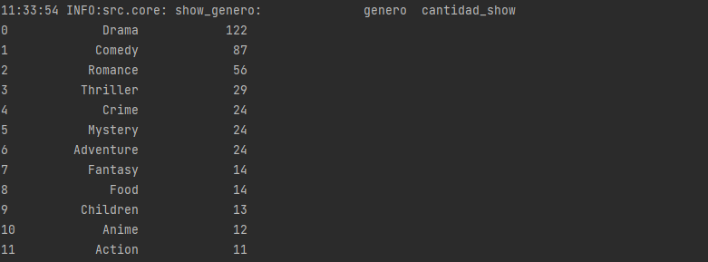
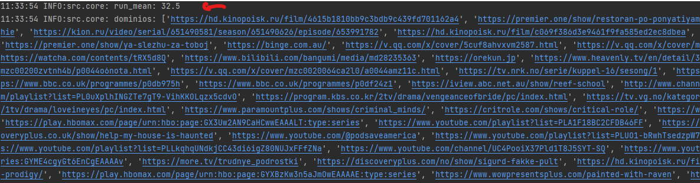

# Tv Shows

## Este repositorio contiene la solución a la prueba de Data Enginner para LuloBank.

Para generar los resultados expuestos aquí, se debe clonar el repositorio:

`git https://github.com/jdrincone/show-tv.git`

Crear un entorno virtual e installar los requerimientos

 `pip install -r requeriments.txt`

Posterior a ello se podra correr el script `python main.py`,
el cual activa todo el pipeline del proyecto en el siguiente orden:

- Se realiza un request al endpoit: http://api.tvmaze.com/schedule/web?date={dia},
  donde el día tomará valores por defaut del mes de dicciembre del 2022.
- La información obtenida se almacenará en formato json_{dia} en `\.json`, luego
  se hara una pequeña transformaran los datos a dataframe, segmentando la data en 
  show de tv por día y el detalle de cada show (información del embebido) en formato
  parquet con compresión snappy. Los resultados podran ser consultados en
 `.\data`.
- Seguido, se contruira un profile para cada dataframe, en este se encontrará
  estadísticos descriptivos y distribución de los feature que contiene cada 
  dataframe, los resultados se almacenan en formato html en `.\profiling`
- Se construye una base de datos en sqlite y se almancen bajo el
  modelo referencial encontrado en `\.model`, el consolidado de los show y detalle
  de estos que fueron emitidos el mes de dicciembre del 2022. La
  base de datos se almacena en la raiz del repositorio en el archivo `lulobank.bd`
  y el cual puede ser abierto en sqlite view https://inloop.github.io/sqlite-viewer/.

-  Por último se muestra por consola:
  - La cantidad de show por genero existentes
    en los show emitidos en las fechas consultadas.
    - El runtime promedio de estos shows.
    - El listado de los link o paginas web oficiales de los shows.

- Por ultimo, se generan algunos test unitarios de funciones 
  del core del proyecto, estos podran ejecutarsen con:

`pytest .\test\test.py`